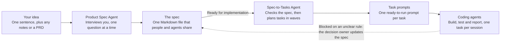

Read the post [Turning Product Ideas into Clear Specifications with AI](https://vespaiach.com/posts/turning-product-ideas-into-clear-specifications-with-ai.html) for more detail.

## Why specs need a new shape

The previous spec template spreads one feature across many sections: user stories in one place, requirements in another, acceptance criteria and tests in a third. Readers have to piece each feature back together, and an agent that updates one copy of a fact can leaves the other copies wrong.

I wanted a new spec that a product person can read in five minutes and an agent can build from without guessing.

## How a session works

You paste the prompt (link in below) into your AI tool and describe your idea in a sentence. From there, the agent works in five stages:

1. **Intake.** It works out whether you're starting fresh, revising a spec, or converting one from another format.
2. **Discovery.** It interviews you one question at a time, with buttons and multi-select where your tool has them.
3. **Draft.** It assembles the spec and checks it for gaps and contradictions.
4. **Clarify.** It turns every open question into a decision with an owner, then resolves them with you one by one.
5. **Finalize.** It sets readiness honestly and hands you the finished spec as a Markdown file.

## One spec, two readers

The spec is a single Markdown document in three layers, so each reader can stop where they need to.

| Layer | What's in it | Who reads it |
| --- | --- | --- |
| Part A: Overview | Where things stand, summary, goals, roles and permissions, features at a glance, boundaries, glossary | Everyone. A business reader can stop here. |
| Part B: Features | One self-contained block per feature | Product, engineering, and the agents building each feature |
| Part C: System | Shared behaviors, data, interfaces, security, quality targets, architecture, operations | Engineers and agents |

## From spec to code

The spec is the first half of a pipeline. A second prompt, the Spec-to-Tasks Agent, reads a finished spec and turns it into ordered tasks. Each task is a ready-to-run prompt: paste it into a fresh coding-agent session and it has everything it needs, copied word for word from the spec.

- **A checker runs first.** `spec-check.py` confirms every ID is defined, every rule has examples, and every TBD points to an open decision. It can also run in CI.
- **Tasks follow feature blocks.** A task builds one feature end to end, and the feature's examples define when it's done.
- **Shared behaviors are built once,** then applied by every feature task.
- **Questions flow back, not into the code.** When a coding agent hits an unclear rule, it stops and proposes a decision instead of guessing. Once the spec is updated, only the affected tasks are regenerated.

## Try it

The agent prompt is the only file you need. The others are there when you want them.

| File | What it is |
| --- | --- |
| [product-spec-agent-loop.md](/product-spec-agent-loop.md) | The Product Spec Agent prompt, with the spec template built in |
| [spec-to-tasks-agent.md](/spec-to-tasks-agent.md) | The Spec-to-Tasks Agent prompt, which turns a finished spec into task prompts |
| [spec-check.py](/spec-check.py) | The checker. Run `python3 spec-check.py your-spec.md` |
| [example-spec-leavedesk.md](example-spec-leavedesk.md) | A complete example spec for a fictional leave-request tool |
| [production-specification-template.md](production-specification-template.md) | The empty spec template on its own |

To start, paste the prompt into your AI tool as the system prompt, as custom instructions or as your first message. Then describe your idea in a sentence.

A few things to know before you try it:

- **It's long.** The prompt is about 40,000 characters. If your tool limits custom instructions to a few thousand characters, upload it as a file or paste it as your first message.
- **It's smoothest with structured input.** It works in plain chat, but tools with buttons and multi-select make the interview faster.
- **A full session takes a while.** One question per turn adds up for a large product. The light depth and "draft it now" keep small products quick.