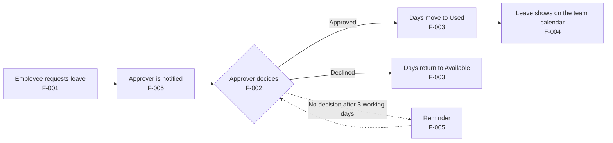
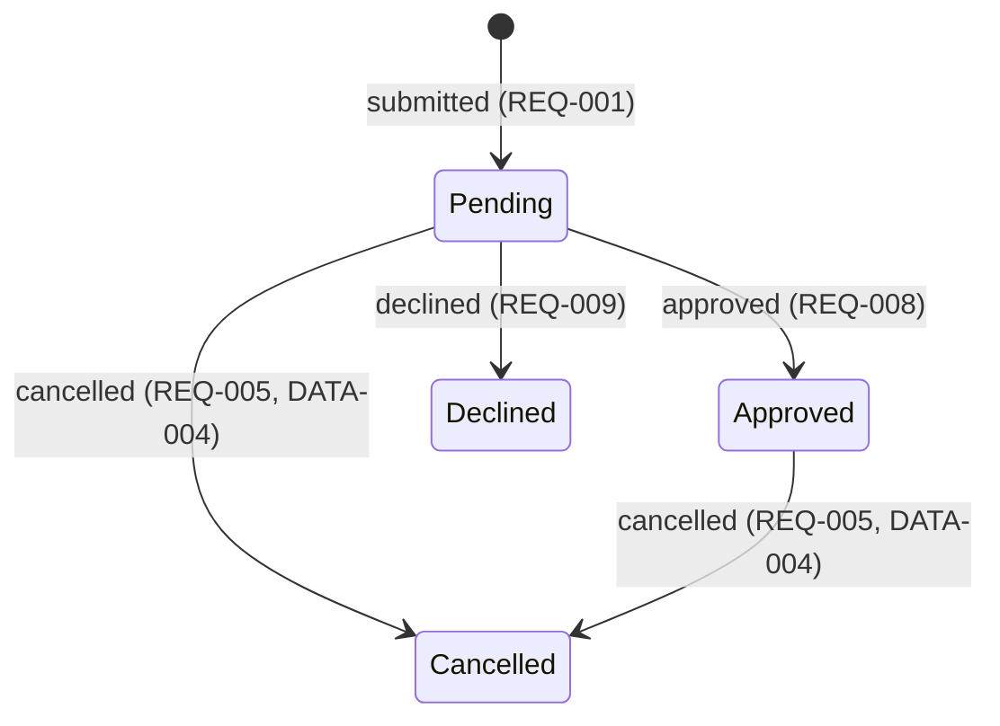

# LeaveDesk: Product Specification

> Example spec for a fictional product. Names, numbers and links are made up.

**How to read this spec**

- **IDs:** `F` feature, `REQ` feature rule, `STD` standard behavior, `DATA`, `SEC`, `NFR`, `OPS` and `API` system-wide items, `DEC` decision, `GOAL` goal. `REQ-007.2` is the second example of rule `REQ-007`.
- **Markers:** `TBD(DEC-004)` means it waits on that decision. `N/A:` means it doesn't apply, followed by the reason.
- **Verify:** `auto` is an automated test, `manual` is a person checking, `ops` is checked on the running system.
- **Defaults:** every feature follows the standard behaviors in section 9 unless its block lists an exception.

---

## Part A: Overview

### 1. Where things stand

**Status: Under review. Readiness: Ready for planning.** Not ready for implementation until DEC-004 is decided and Lee Kim approves.

**Blocking decisions**

| ID | Question | Blocks | Owner | Due |
|---|---|---|---|---|
| DEC-004 | How do unused annual leave days carry over into the next leave year? Options: carry over up to 5 days that expire on 31 March (HR prefers this); no carry-over; carry over everything. | Implementation: REQ-016 (F-003) | Dana Ortiz | 9 Oct 2026 |

**Other open questions (not blocking)**

- DEC-007: Which job queue sends notifications and reminders. Lee Kim decides during the build, within the limits in section 14.
- DEC-008: Which file format the payroll export needs. Only affects F-007, which is planned for later.

**What changed in v0.3** (since v0.2 on 21 Sep 2026)

- Changed REQ-011: the first reminder now goes out after 3 working days (was 5).
- Added REQ-020: people without a Slack account get email only.
- Added REQ-021, REQ-022, REQ-023, SEC-006 and OPS-004 by splitting REQ-005, REQ-009, REQ-014, SEC-001 and OPS-003, so each rule covers one behavior.
- Superseded REQ-006 (half-day requests) after DEC-005.

**Approvals for v0.3**

- Dana Ortiz (Head of People): approved 28 Sep 2026.
- Lee Kim (Tech lead): waiting on DEC-004.

**Readiness checklist**

- [x] Owners, release and scope are set.
- [x] No open decisions block planning.
- [ ] No open decisions block implementation. *(DEC-004)*
- [x] Every R1 feature still in scope is Approved.
- [ ] Nothing in R1 is marked TBD. *(REQ-016)*
- [ ] Every R1 rule has at least one example and a way to verify it. *(REQ-016)*
- [x] Every Part C section is filled in or marked N/A with a reason.
- [ ] Every approver has approved this version. *(Lee Kim)*

### 2. Summary

Employees ask for leave by emailing their manager, and HR tracks balances in a shared spreadsheet. HR spends about 6 hours a week keeping it up to date, managers approve without seeing who else is away, and balance mistakes have led to payroll corrections. LeaveDesk puts requests, approvals, balances and a team calendar in one place, with Slack and email notifications. It's for all 180 employees, their managers and the HR team. We need it now because headcount passes 250 next year, and the spreadsheet already broke during last December's rush.

### 3. Goals and success metrics

| ID | Goal | Metric and target | How measured |
|---|---|---|---|
| GOAL-1 | Less HR admin time | HR time on leave admin drops from about 6 hours a week to 1 hour or less, 3 months after launch | HR's time log, monthly |
| GOAL-2 | Faster decisions | 90% of requests decided within 2 working days, from 3 months after launch | Time to decision on the dashboard (section 15) |
| GOAL-3 | Correct balances | No payroll corrections caused by leave balances in the first quarter after launch | Payroll's correction log |

### 4. Users, roles and permissions

| Role | Who |
|---|---|
| Employee | Everyone with a company account |
| Manager | Anyone with direct reports in the directory |
| HR admin | Members of the SSO group `leavedesk-hr-admins` (SEC-004) |

| Action | Employee | Manager | HR admin |
|---|---|---|---|
| Request leave for themselves | Yes | Yes | Yes |
| Cancel their own leave | Until it starts (REQ-021) | Until it starts | Until it starts |
| Cancel anyone's leave, at any time, with a reason | No | No | Yes |
| Approve or decline requests | No | Direct reports | Any request except their own (REQ-012) |
| See their own balances | Yes | Yes | Yes |
| Adjust balances | No | No | Yes |
| See approved leave dates | Own team | Own team | Everyone |
| See others' pending requests, leave types and notes | No | Direct reports | Everyone |

### 5. Features at a glance

| ID | Feature | Goals | Release | Priority | Status |
|---|---|---|---|---|---|
| F-001 | Request leave | GOAL-2, GOAL-3 | R1 | Must | Approved |
| F-002 | Approve or decline | GOAL-2 | R1 | Must | Approved |
| F-003 | Leave balances | GOAL-1, GOAL-3 | R1 | Must | Approved |
| F-004 | Team calendar | GOAL-2 | R1 | Should | Approved |
| F-005 | Notifications | GOAL-2 | R1 | Must | Approved |
| F-006 | Sync leave to Google Calendar | None | Later | Could | Proposed |
| F-007 | Payroll export | GOAL-1 | Later | Should | Proposed |
| F-008 | Leave settings for HR | GOAL-1 | Later | Should | Proposed |

Features planned for later get a block in Part B once they're scheduled for a release. F-006 doesn't serve a goal. It stays as a Could because it was the most requested item in the employee survey.

### 6. How it fits together

Each step belongs to one feature, and Part B describes it.

### 7. Boundaries

**Out of scope**

- Tracking working hours or overtime.
- Replacing payroll or the HR system.
- Leave for contractors, who aren't in the directory.

**Assumptions**

- The HR system's API returns a manager and an office for every active employee. IT confirms this with a test sync by 5 Oct 2026.
- Every employee, including part-time staff, has a company SSO account.

**Dependencies**

- IT registers LeaveDesk with SSO and approves the Slack app by 12 Oct 2026.
- HR provides cleaned-up balances from the spreadsheet one week before the pilot.

**Known limitations in R1**

- Whole days only (DEC-005). HR records half days as balance adjustments.
- One approver per request (DEC-003).
- HR can't change leave types or office holidays in the app until F-008. Until then a developer makes the change (section 14).

### 8. Glossary

- **Leave year:** 1 January to 31 December.
- **Working day:** Monday to Friday, except holidays of the employee's office.
- **Allowance:** the days an employee gets for a leave type in a leave year.
- **Used:** days in Approved requests.
- **Pending:** days in Pending requests.
- **Available:** Allowance plus adjustments, minus Used and Pending.
- **Approver:** the person who decides a request (REQ-001 says who).
- **Team:** a manager and their direct reports. Managers see both the team they lead and the team they belong to.
- **Directory:** the company's HR system. It's the source for employees, managers, offices and start dates.

---

## Part B: Features

### F-001 Request leave

**Release:** R1 · **Priority:** Must · **Status:** Approved · **Goals:** GOAL-2, GOAL-3 · **Design:** [Request leave](https://example.com/design/leavedesk#request)

**What and why:** Employees request time off in one place and see right away how many days it uses. This replaces emailing the manager and waiting for HR to update the spreadsheet.

**Flow**

1. Employee opens "Request leave", picks a leave type and dates, and can add a note.
2. LeaveDesk shows how many days the request uses and what will be left.
3. Employee submits. The request is Pending and the approver is notified (F-005).
4. The employee can cancel the request later (REQ-005).

**Rules and examples**

- **REQ-001** When an employee submits a request, the system shall save it as Pending and assign it to the employee's manager in the directory, or to the HR admins if the employee has no manager.
  - REQ-001.1: Employee with a manager submits → Pending; the approver is their manager. (Verify: auto)
  - REQ-001.2: Employee with no manager submits → Pending; the approvers are the HR admins. (Verify: auto)
- **REQ-002** While the employee fills in the form, the system shall show how many days the request uses and what will be left afterwards.
  - REQ-002.1: 3 days of annual leave with 10 available → "Uses 3 days. 7 left after this." (Verify: auto)
- **REQ-003** If the leave type tracks a balance and the request needs more days than are available, the system shall block submission.
  - REQ-003.1: 2 days available, asks for 3 → blocked: "This needs 3 days. You have 2." (Verify: auto)
  - REQ-003.2: 10 days of unpaid leave, which has no balance → allowed. (Verify: auto)
- **REQ-004** If the dates overlap the employee's own Pending or Approved leave, the system shall block submission.
  - REQ-004.1: Approved leave on 3–5 June, new request for 5–6 June → blocked: "You already have leave on 5 June." (Verify: auto)
- **REQ-005** When a request is cancelled, the system shall set it to Cancelled and return its days to Available.
  - REQ-005.1: Requester cancels approved leave that starts next week → Cancelled; days back in Available; the manager is notified. (Verify: auto)
  - REQ-005.3: HR admin cancels leave that has started, with the reason "Wrong dates" → Cancelled; days back in Available; the requester is notified. (Verify: auto)
- **REQ-021** If a requester tries to cancel their own leave after it has started, the system shall block the cancellation.
  - REQ-021.1: Requester tries to cancel leave that started yesterday → blocked: "Leave that has started can only be changed by HR." (Verify: auto)
- **REQ-007** If the start date is more than 12 months ahead, or further in the past than the leave type allows, the system shall block submission.
  - REQ-007.1: Annual leave starting yesterday → blocked: "Annual leave can't start in the past." (Verify: auto)
  - REQ-007.2: Sick leave for last Tuesday → allowed, because sick leave can go back 14 days. (Verify: auto)
  - REQ-007.3: Sick leave that started 20 days ago → blocked: "For sick leave older than 14 days, contact HR." (Verify: auto)

*REQ-006 was superseded in v0.3 (see Appendix B).*

**Exceptions to standard behaviors:** None.
**Uses:** LeaveRequest, LeaveType · API-001, API-002 · DATA-003
**Open:** None.

### F-002 Approve or decline

**Release:** R1 · **Priority:** Must · **Status:** Approved · **Goals:** GOAL-2 · **Design:** [Approvals](https://example.com/design/leavedesk#approve)

**What and why:** Approvers decide on requests quickly, seeing who else on the team is away. Decisions reach the employee straight away instead of waiting in an inbox.

**Flow**

1. Approver opens the request from a notification or from their "Waiting for you" list.
2. LeaveDesk shows the dates, the days used, the balance afterwards and teammates already away on those dates.
3. Approver approves, or declines with a reason.
4. The requester is notified (F-005). Approved leave appears on the team calendar (F-004).

**Rules and examples**

- **REQ-008** When the approver approves a Pending request, the system shall set it to Approved and move its days from Pending to Used.
  - REQ-008.1: 3-day request approved → Approved; Pending down 3, Used up 3. (Verify: auto)
- **REQ-009** When the approver declines a request with a reason, the system shall set it to Declined, return its days to Available and show the reason to the requester.
  - REQ-009.2: Decline with the reason "Release week" → Declined; 3 days back in Available; the requester sees the reason. (Verify: auto)
- **REQ-022** If the approver declines a request without a reason, the system shall block the decision.
  - REQ-022.1: Decline without a reason → blocked: "Add a reason so they know why." (Verify: auto)
- **REQ-010** The system shall show, with each request, the teammates who have approved leave on any of the requested days.
  - REQ-010.1: Request for 3–4 June while Ana has approved leave on 4 June → "Also away: Ana (4 June)". (Verify: auto)
- **REQ-011** If a request is still Pending after 3 working days, the system shall send a first reminder, and a second one after 5 working days. F-005 lists who receives them.
  - REQ-011.1: Submitted Monday at 10:00, no decision → first reminder Thursday at 10:00. (Verify: auto)
  - REQ-011.2: Still no decision the following Monday at 10:00 → second reminder. (Verify: auto)
- **REQ-012** If the approver is also the requester, the system shall not let them decide the request.
  - REQ-012.1: Priya, an HR admin with no manager in the directory, requests leave → it goes to the HR admins, and Priya can't decide it; API-004 returns 403 (STD-2). (Verify: auto)

**Exceptions to standard behaviors:** None.
**Uses:** LeaveRequest · API-003, API-004
**Open:** None.

### F-003 Leave balances

**Release:** R1 · **Priority:** Must · **Status:** Approved · **Goals:** GOAL-1, GOAL-3 · **Design:** [My leave](https://example.com/design/leavedesk#balances)

**What and why:** Everyone sees an up-to-date balance for each leave type, and HR corrects balances with a recorded reason. LeaveDesk replaces the spreadsheet as the place where balances live.

**Flow**

1. Employee opens "My leave" and sees this year's balance for each leave type.
2. They open a leave type to see its history of requests and adjustments.
3. HR admin opens an employee and adds an adjustment with a reason.
4. On 1 January, the new leave year starts (REQ-016).

**Rules and examples**

- **REQ-013** The system shall show each employee their Allowance, Used, Pending and Available days for every leave type that tracks a balance, for the current leave year.
  - REQ-013.1: Allowance 25, Used 8, Pending 3, no adjustments → Available 14. (Verify: auto)
- **REQ-014** When an HR admin adjusts a balance with a reason, the system shall apply the adjustment and show it in the employee's history.
  - REQ-014.1: +2 days with the reason "Worked on a public holiday" → Available up 2; history shows the reason, who made it and when. (Verify: auto)
- **REQ-023** If an HR admin tries to adjust a balance without a reason, the system shall block the adjustment.
  - REQ-023.1: Adjustment without a reason → not saved (STD-3). (Verify: auto)
- **REQ-015** For employees who join during the leave year, the system shall prorate the allowance by the full months left in the year, rounded up to a whole day.
  - REQ-015.1: Joins 1 July, 25-day allowance → 6 months → 12.5 → 13 days. (Verify: auto)
  - REQ-015.2: Joins 15 July → 5 full months → 10.4 → 11 days. (Verify: auto)
- **REQ-016** When a new leave year starts, the system shall reset allowances and carry over unused days as TBD(DEC-004).
  - Examples: TBD(DEC-004)

**Exceptions to standard behaviors:** None.
**Uses:** BalanceAdjustment, LeaveType · API-005, API-006 · DATA-001
**Open:** TBD(DEC-004), the carry-over rule.

### F-004 Team calendar

**Release:** R1 · **Priority:** Should · **Status:** Approved · **Goals:** GOAL-2 · **Design:** [Team calendar](https://example.com/design/leavedesk#calendar)

**What and why:** A month view shows who on the team is away, so people can plan around each other. It replaces asking around and checking the spreadsheet.

**Flow**

1. User opens "Team calendar" and sees this month for their team.
2. They move between months. HR admins can also pick any team.
3. Selecting someone's leave shows its details.

**Rules and examples**

- **REQ-017** The system shall show one month of the viewer's team, including only the leave that section 4 lets the viewer see.
  - REQ-017.1: Employee views their team while a teammate's request is Pending → the pending request isn't shown. (Verify: auto)
  - REQ-017.2: Their manager views the same month → the request is shown, marked "Pending". (Verify: auto)
- **REQ-018** If the viewer may not see a teammate's leave type (section 4), the system shall show "Away" instead.
  - REQ-018.1: Employee views a teammate on sick leave → "Away". (Verify: auto)
  - REQ-018.2: The teammate's manager views the same day → "Sick leave". (Verify: auto)

**Exceptions to standard behaviors:** None.
**Uses:** LeaveRequest · API-007
**Open:** None.

### F-005 Notifications

**Release:** R1 · **Priority:** Must · **Status:** Approved · **Goals:** GOAL-2 · **Design:** [Message copy](https://example.com/design/leavedesk#messages)

**What and why:** People hear about requests and decisions in Slack and email, so nobody has to check LeaveDesk to find out something needs them. Quick notice is the main way to speed up decisions.

**Flow**

1. Something happens to a request (see the table below).
2. LeaveDesk sends the listed people a Slack direct message and an email.
3. Each message links straight to the request.

**Who gets notified**

| Event | Who |
|---|---|
| Request submitted (REQ-001) | Approver |
| Request approved or declined (REQ-008, REQ-009) | Requester |
| Request cancelled (REQ-005) | Approver; the requester too if an HR admin cancelled it |
| First reminder (REQ-011) | Approver |
| Second reminder (REQ-011) | Approver and HR admins |
| Employee deactivated (DATA-004) | HR admins |
| Manager changed while a request is waiting (DATA-005) | Old and new manager |

**Rules and examples**

- **REQ-019** When an event in the table happens, the system shall send each listed person a Slack direct message and an email, both linking to the request, within the time set in NFR-003.
  - REQ-019.1: Employee submits → the approver gets a Slack message and an email, both linking to the request. (Verify: auto)
  - REQ-019.2: Slack is down → the email still goes out; the Slack message is retried for up to 1 hour, then dropped and logged. (Verify: auto)
- **REQ-020** If a person has no Slack account, the system shall send them email only.
  - REQ-020.1: A new joiner without Slack gets a decision → email only, and no error. (Verify: auto)

**Exceptions to standard behaviors:** Notifications are retried in the background for longer than STD-7 allows: Slack for up to 1 hour and email for up to 24 hours. After that they're dropped and logged.
**Uses:** Slack and the email relay (section 11) · NFR-003
**Open:** None.

---

## Part C: System

### 9. Standard behaviors

Every feature follows these unless its block lists an exception.

| ID | Situation | What happens |
|---|---|---|
| STD-1 | Not signed in | The user is sent to company sign-in. The API returns 401. |
| STD-2 | Not allowed | "You don't have access to this." The API returns 403 for items the user can see but can't act on, and 404 for items they can't see, so it never reveals that an item exists. |
| STD-3 | Invalid input | Errors appear next to each field, input is kept and nothing is saved. The API returns 422 with the field errors. |
| STD-4 | Item not found | "This no longer exists." The API returns 404. |
| STD-5 | Same action sent twice | Buttons are disabled while saving. A repeated call with the same `Idempotency-Key` within 24 hours returns the first result. |
| STD-6 | Someone else changed it first | The save is rejected: "This changed since you opened it. Reload to see the latest." The API returns 409. |
| STD-7 | A service we depend on fails | Retried 3 times over about a minute, then "Something went wrong. Try again later." Logged with a correlation ID. Side effects such as notifications are queued, so the user's action still succeeds. |
| STD-8 | Every screen | Has loading, empty and error states, and meets NFR-004 (accessibility) and NFR-005 (browsers and devices). |
| STD-9 | Every change | Each create, cancel, decision and adjustment is recorded with who, when and what changed. Records can't be edited and are kept as DATA-002 says. |

Verify: automated tests cover each standard behavior on every screen and API call it applies to.

### 10. Data model and lifecycle

| Entity | What it holds | Notes |
|---|---|---|
| Employee | Name, email, manager, office, start date, active | Synced from the directory (section 11) |
| LeaveType | Name, whether it tracks a balance, yearly allowance, how far back it can be requested | Set in config in R1 (section 14) |
| LeaveRequest | Employee, leave type, start and end date, days, status, approver, note, decline reason, version | End date is on or after the start date. Days are fixed at submission. |
| BalanceAdjustment | Employee, leave type, days (plus or minus), reason, who, when | |
| OfficeHoliday | Office, date, name | Set in config in R1 (section 14) |

**Leave types in R1**

| Type | Tracks a balance | Yearly allowance | Can be requested for past days |
|---|---|---|---|
| Annual | Yes | 25 days | No |
| Sick | No | None | Up to 14 days back |
| Unpaid | No | None | No |

**Request lifecycle**

Declined and Cancelled are final. Approved leave stays Approved after its dates pass.

**Rules and examples**

- **DATA-001** Balances are calculated from allowances, adjustments and requests each time they're shown. They're never stored as a number anyone can edit.
  - DATA-001.1: A request goes from Pending to Approved → every screen shows the new balance, with no separate update step. (Verify: auto)
- **DATA-002** Requests, adjustments and change records are kept for 6 years after the end of their leave year, then deleted by a nightly job. Nothing is deleted earlier, including when someone leaves the company.
  - DATA-002.1: A request from leave year 2027 → deleted by the first nightly run after 31 December 2033. (Verify: auto)
- **DATA-003** Only working days count toward a request.
  - DATA-003.1: Friday to the following Monday → 2 days. (Verify: auto)
  - DATA-003.2: Monday to Friday with an office holiday on Wednesday → 4 days. (Verify: auto)
- **DATA-004** When the directory marks an employee inactive, the system shall cancel their Pending requests and any Approved leave that hasn't started.
  - DATA-004.1: Employee leaves on 30 September with approved leave in October → that leave is Cancelled; HR admins are notified. (Verify: auto)
- **DATA-005** When an employee's manager changes in the directory, the system shall move their Pending requests to the new manager.
  - DATA-005.1: Pending request, manager changes from Ana to Ben → the request now waits for Ben; both are notified. (Verify: auto)
- **DATA-006** Opening balances are imported once from the spreadsheet, as adjustments with the reason "Opening balance".
  - DATA-006.1: Spreadsheet shows 12 days left, LeaveDesk calculates 25 → an adjustment of −13; Available shows 12. (Verify: manual; HR checks every employee before launch)

### 11. Interfaces and integrations

**LeaveDesk API**

Only the LeaveDesk web app calls this API in R1. Full request and response schemas are in `openapi.yaml`. Errors follow STD-1 to STD-6, and every POST accepts an `Idempotency-Key` header (STD-5).

| ID | Call | Used by |
|---|---|---|
| API-001 | `POST /api/requests` | F-001 |
| API-002 | `POST /api/requests/{id}/cancel` | F-001 |
| API-003 | `GET /api/requests?approver=me&status=pending` | F-002 |
| API-004 | `POST /api/requests/{id}/decision` | F-002 |
| API-005 | `GET /api/balances?employee={id}` | F-003 |
| API-006 | `POST /api/balances/{employeeId}/adjustments` | F-003 |
| API-007 | `GET /api/calendar?team={id}&month={yyyy-mm}` | F-004 |

**Versioning:** N/A: nothing outside LeaveDesk calls this API in R1, and the API ships together with the web app.

**Outside systems**

| System | Used for | If it fails | Owner |
|---|---|---|---|
| Directory (HR system API) | Employees, managers, offices and start dates, synced every night at 02:00 | Keep the last good data. Alert per OPS-001. | IT |
| Company SSO (OIDC) | Sign-in and the HR admin group | Nobody can sign in. Show "Sign-in is unavailable right now." | IT |
| Slack | Direct messages | Email still goes out. Retries follow F-005. | IT |
| Email relay (SMTP) | Emails | Retries follow F-005. Alert per OPS-002. | IT |

### 12. Security and privacy

- **SEC-001** Sign-in is only possible through company SSO.
  - SEC-001.1: Someone without a company SSO account opens LeaveDesk → they can't sign in, and there's no other way in. (Verify: manual)
- **SEC-006** If a user has been inactive for 8 hours, the system shall end their session.
  - SEC-006.1: No activity for 8 hours → the next action asks the user to sign in again. (Verify: auto)
- **SEC-002** Every API call checks the permissions in section 4 on the server. Hiding a button in the app is never the only check.
  - SEC-002.1: Employee calls API-004 for a request in another team → 404, as STD-2 says for items they can't see. (Verify: auto)
- **SEC-003** Leave types and notes are personal data, and sick leave is health data. Apart from where section 4 allows them to be shown, they never appear in logs, analytics or shared Slack channels.
  - SEC-003.1: A sick leave request is submitted → the logs contain its request ID but not its leave type or note. (Verify: auto)
- **SEC-004** HR admin rights come only from the SSO group `leavedesk-hr-admins`. They can't be granted inside LeaveDesk.
  - SEC-004.1: Someone is removed from the group → from their next sign-in they no longer have HR admin rights. (Verify: manual)
- **SEC-005** Data is encrypted in transit (TLS 1.2 or later) and at rest, including backups.
  - SEC-005.1: TLS scan of the production address → only TLS 1.2 and 1.3 accepted. (Verify: ops)

**Rate limiting:** N/A: LeaveDesk is only reachable after company sign-in and has no public endpoints.

**Threats**

| Threat | Handled by |
|---|---|
| A coworker sees someone's sick leave | REQ-018, SEC-002, SEC-003 |
| A manager acts on a request outside their team | SEC-002 |
| An HR admin misuses their access | STD-9 records every change; Dana Ortiz reviews the HR admin group each quarter |

### 13. Quality targets

| ID | Area | Target | How measured |
|---|---|---|---|
| NFR-001 | Speed | Screens and API calls respond within 1 second for 95% of requests, with 250 employees and 3 years of data | Load test in staging before launch |
| NFR-002 | Availability | Up 99.5% of office hours (Monday to Friday, 07:00 to 19:00 office time) | Uptime monitor, monthly |
| NFR-003 | Notification speed | 95% of notifications sent within 2 minutes of the event | Queue metrics on the dashboard (section 15) |
| NFR-004 | Accessibility | Meets WCAG 2.2 level AA | Automated checks on every screen, plus a keyboard-only run through requesting and approving leave before launch |
| NFR-005 | Browsers and devices | Latest two versions of Chrome, Edge, Firefox and Safari, on screens 360 px wide and up | Manual check before launch |
| NFR-006 | Recovery | Lose at most 24 hours of data and be running again within 4 hours | Restore test (OPS-004) |
| NFR-007 | Cost | Hosting under $300 a month | Cloud bill, monthly |

**Language:** English only in R1.

### 14. Architecture and constraints

- **Stack:** follows the [company web app baseline](https://example.com/eng/web-app-baseline): TypeScript, React, Node.js and PostgreSQL, deployed as one service on the existing container platform.
- **Build, test and lint commands:** in `AGENTS.md` in the repository. They aren't copied here.
- **Boundaries:**
  - Only the directory sync job writes Employee records.
  - Web requests never wait for Slack or email. A background worker sends notifications.
  - One module calculates balances, and every screen and API call uses it (DATA-001).
- **Sources of truth:** people and reporting lines come from the directory. Everything about leave lives in the LeaveDesk database.
- **Environments:** local (fake directory data), staging (a test Slack workspace and made-up employees), production.
- **Configuration:** leave types and office holidays live in `config/leave-policy.yaml`. HR asks for changes, and a developer makes them in a pull request that HR reviews. F-008 will replace this.
- **Limits for delegated decisions:** DEC-007 (job queue): it runs on PostgreSQL with no new infrastructure, doesn't lose jobs on restart, and supports jobs scheduled for later (for reminders).

### 15. Operations and release

**Monitoring**

- **OPS-001** Alert the tech lead if the directory sync fails two nights in a row.
  - OPS-001.1: The sync fails at 02:00 on Monday and again on Tuesday → the tech lead is alerted on Tuesday morning. (Verify: ops)
- **OPS-002** Alert the tech lead if any notification has waited in the queue for more than 15 minutes.
  - OPS-002.1: The email relay is down for 20 minutes → an alert fires once the oldest email has waited 15 minutes. (Verify: ops)
- **OPS-003** Back up the database every day and keep backups for 30 days.
  - OPS-003.1: Any day → there's a backup from each of the last 30 days, and none older. (Verify: ops)
- **OPS-004** Test a restore before launch and every quarter after that.
  - OPS-004.1: Last night's backup is restored into staging → running again within 4 hours (NFR-006). (Verify: ops)
- Logs are structured JSON with a correlation ID and follow SEC-003.
- The dashboard shows requests per day, time to decision (GOAL-2) and notification delay (NFR-003).

**Release plan**

1. Import opening balances (DATA-006). HR checks every employee's balance and signs off.
2. Pilot with two teams, about 20 people, for two weeks. The spreadsheet stays as a backup.
3. Open to everyone. The spreadsheet becomes read-only.

**Rollback:** during the pilot and the first month after launch, go back to the spreadsheet if balances are wrong for more than 5 people or LeaveDesk is down for more than a day. Export all LeaveDesk requests to CSV so HR can copy them into the spreadsheet. Sam Patel makes the call.

**If LeaveDesk is down:** employees email their manager as before, and HR enters those requests once it's back.

**After launch:** check time to decision and notification delay every day for 4 weeks.

---

## Appendix

### A. Decision history

Resolved decisions and the reasons behind them, so nobody undoes them by accident. Open decisions are in section 1.

| ID | Decision | Why | Decided |
|---|---|---|---|
| DEC-001 | Sign-in only through company SSO. LeaveDesk has no passwords of its own. | Nothing to reset or leak, and leavers lose access automatically. | Lee Kim, 10 Sep 2026 |
| DEC-002 | Balances are calculated, never stored (DATA-001). | The spreadsheet went wrong because people edited numbers by hand. | Dana Ortiz, 12 Sep 2026 |
| DEC-003 | One approver per request in R1. | It covers every current team. Approval chains would add weeks of work. | Dana Ortiz, 15 Sep 2026 |
| DEC-005 | Whole days only in R1. REQ-006 superseded. | Half days were 3% of last year's requests. HR can handle them as adjustments. | Dana Ortiz, 24 Sep 2026 |
| DEC-006 | Coworkers see "Away", not the leave type (REQ-018). | Sick leave is health data. | Dana Ortiz, 18 Sep 2026 |

### B. Revision history

| Version | Date | Author | Summary | Approval |
|---|---|---|---|---|
| 0.1 | 12 Sep 2026 | Sam Patel | First draft | None |
| 0.2 | 21 Sep 2026 | Sam Patel | Added F-004 and F-005, with the privacy rule from DEC-006 | Dana Ortiz, 22 Sep 2026 |
| 0.3 | 28 Sep 2026 | Sam Patel | Changed REQ-011, added REQ-020, split five rules into REQ-021, REQ-022, REQ-023, SEC-006 and OPS-004, superseded REQ-006 | Dana Ortiz, 28 Sep 2026. Lee Kim pending. |

**Superseded items**

- REQ-006 (added in v0.2, superseded in v0.3 by DEC-005): "Employees can request half days for any leave type."
